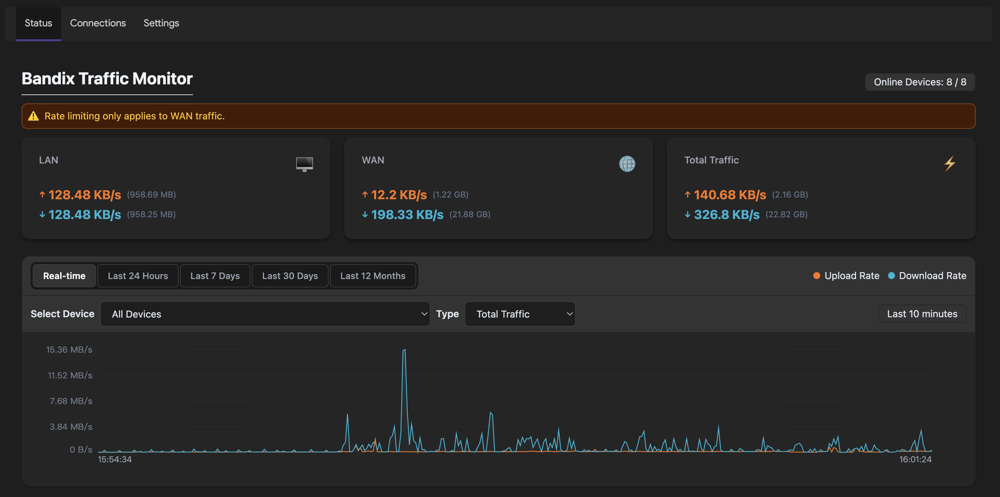

# LuCI Bandix

English | [简体中文](README.zh.md)

[](LICENSE)


LuCI Bandix is a network traffic monitoring application for OpenWrt, providing intuitive traffic data visualization and analysis through the LuCI web interface.

## Introduction

LuCI Bandix is developed based on the LuCI framework, offering network traffic monitoring capabilities for OpenWrt routers. This application depends on the openwrt-bandix backend service and helps users view and analyze network traffic statistics in real-time.





## System Requirements

- **OpenWrt Version**: Recommended OpenWrt 24.10 and above
- **Package Format Support**: Supports APK and IPK package formats


## Features

- Real-time network traffic monitoring
- Intuitive data visualization interface
- Seamless integration with OpenWrt system
- Automatically obtain the host name from DHCP/DNS (Static Leases)
- High-performance implementation based on Rust eBPF
- Support for LAN/WAN speed monitoring
- Support for WAN speed limitation
- Persistent data storage
- Historical traffic trends and charts

## Version Dependencies

The following table shows the version dependency relationship between luci-app-bandix and openwrt-bandix:

| luci-app-bandix version | Required openwrt-bandix version |
|------------------------|--------------------------------|
| 0.2.x                  | 0.2.x                          |
| 0.3.x                  | 0.3.x                          |
| 0.4.x                  | 0.4.x                          |

Please ensure you install matching versions to ensure compatibility and proper functionality.

## Installation


1. First install the openwrt-bandix backend

   Download the appropriate package for your device from [openwrt-bandix Releases](https://github.com/timsaya/openwrt-bandix/releases), then install:

   ```bash
   opkg install bandix_latest_architecture.ipk  # (or apk add --allow-untrusted bandix_latest_architecture.apk)
   ```

2. Install the luci-app-bandix frontend

   Download the package from [luci-app-bandix Releases](https://github.com/timsaya/luci-app-bandix/releases), then install:

   ```bash
   opkg install luci-app-bandix_latest_all.ipk  # (or apk add --allow-untrusted luci-app-bandix_latest_all.apk)
   ```

3. Configure your LAN interface in settings

   After installation, go to the Bandix settings page and select your LAN interface to enable proper monitoring. Make sure to check the "Enable" option to start the service.

## Configuration

After installation, you can access the Bandix application through the LuCI web interface. The application is located under the "Network" menu.


## Community & Support

Join our Discord community for help, discussions, and updates:


- https://discord.gg/zNxxA2J2


## Maintainer

- [timsaya](https://github.com/timsaya)

## License

This project is licensed under the [Apache 2.0 License](LICENSE).

## Contributing

Issue reports and improvement suggestions are welcome! Please participate through GitHub Issues or Pull Requests. 